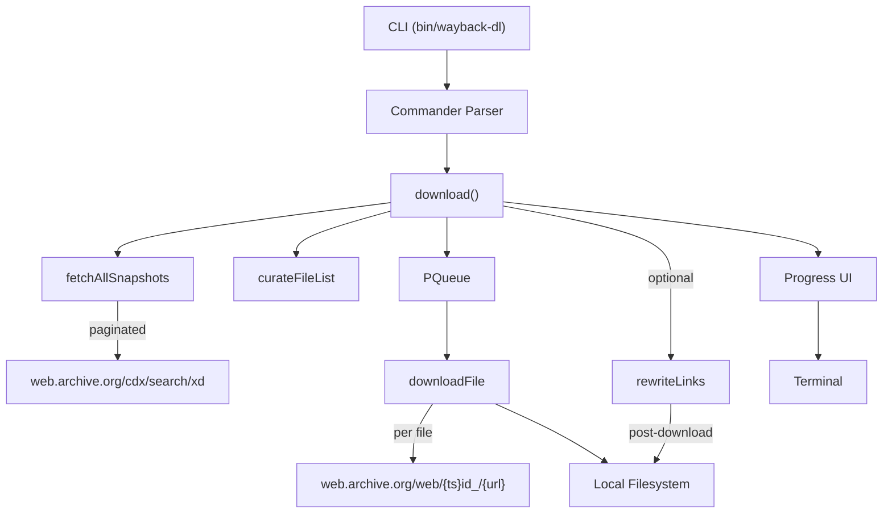

# Architecture

## Overview

wayback-dl is a TypeScript CLI tool that downloads archived websites from the Internet Archive Wayback Machine. It uses the CDX API for snapshot discovery and fetches original file content via the Wayback Machine's raw file endpoint.

## Data Flow



## Modules

| Module | Purpose |
|--------|---------|
| `src/cli.ts` | CLI entry point, argument parsing via Commander |
| `src/downloader.ts` | Orchestrator: fetches snapshots, curates list, runs download queue |
| `src/cdx.ts` | CDX API client for snapshot discovery (paginated) |
| `src/file-manager.ts` | File download, directory creation, conflict resolution |
| `src/link-rewriter.ts` | Post-download: rewrites absolute URLs to relative paths in HTML/CSS |
| `src/progress.ts` | Colorful terminal progress bars (cli-progress, chalk) |
| `src/retry.ts` | Generic exponential backoff utility |
| `src/utils.ts` | URL parsing, path extraction, filter matching |
| `src/types.ts` | Shared TypeScript interfaces |

## CDX API

- **Endpoint:** `https://web.archive.org/cdx/search/xd`
- **Parameters:** `output=json`, `url`, `fl=timestamp,original`, `collapse=digest`, `filter=statuscode:200` (unless `--all`)
- **Pagination:** `page` parameter (0-indexed), up to `maxPages` (default 100)
- **Wildcard:** For full-site download, uses `url/*` to discover all paths

## Download URL Format

```
https://web.archive.org/web/{timestamp}id_/{original_url}
```

The `id_` modifier requests original file content without Wayback Machine rewriting.

## Link Rewriting (optional)

When `--rewrite-links` is set, after all downloads complete the link rewriter scans HTML and CSS files and converts same-origin absolute URLs to relative paths, but only when the target file exists locally. This enables local browsing without broken links.


- **Base delay:** 1 second
- **Max delay:** 30 seconds
- **Exponential backoff:** `min(baseDelay * 2^attempt, maxDelay)`
- **Jitter:** ±20% to avoid thundering herd
- **Default retries:** 5 per file

## Concurrency

- Uses `p-queue` for controlled parallelism
- Default: 5 concurrent downloads
- Configurable via `--concurrency`
